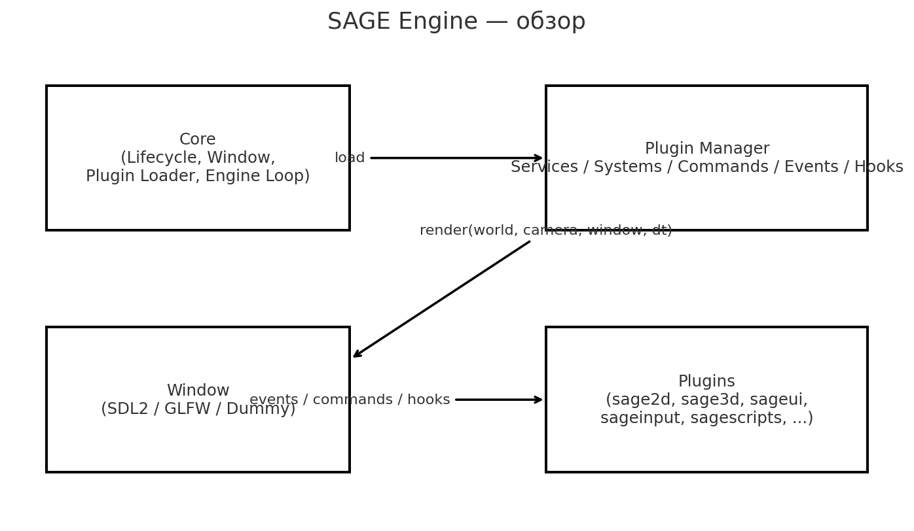
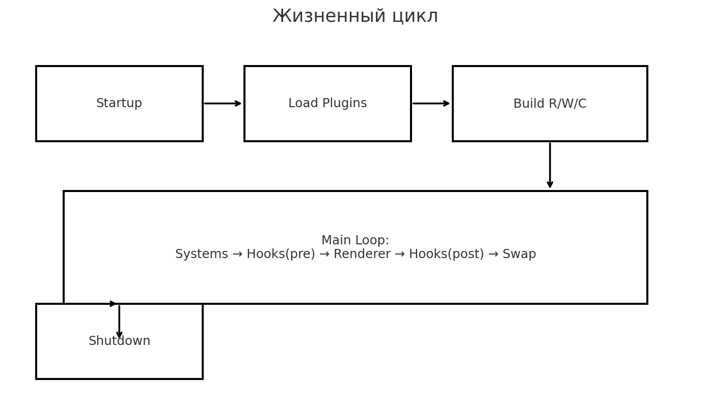
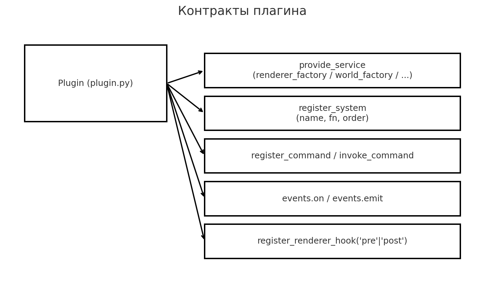
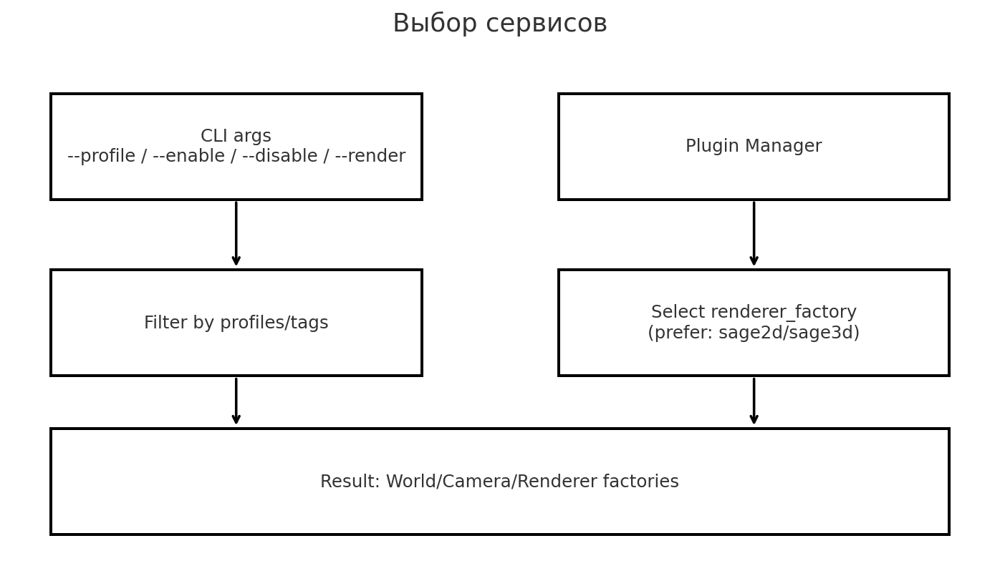

# Архитектура

## Компоненты ядра

- **Lifecycle** — запуск/остановка.
- **Window** — абстракции окон (SDL2, GLFW, Dummy).
- **Plugin Loader** — загрузка плагинов из `plugins/`, манифест `plugin.json`.
- **Engine Loop** — главный цикл: расчёт dt, запуск систем, вызов рендера.

Ядро **не** содержит сцен/камер/рендеров — они приходят через **сервисы плагинов**.

## Жизненный цикл кадра

1. Загрузка плагинов → регистрация сервисов/систем/команд/хуков/событий.
2. Выбор сервисов: `renderer_factory`, `world_factory`, `camera_factory`.
3. Цикл:
   - `PluginManager.run_systems(engine, dt)` — перефрейм‑системы (input, скрипты, UI и т.д.).
   - `pre` рендер‑хуки (например, оси/грид).
   - `renderer.render(world, camera, window, dt)` — отрисовка кадра.
   - `post` рендер‑хуки (если есть).
   - обновление окна.

## Регистры и взаимодействие

- **Сервисы**: именованные фабрики (`provide_service/get_service/get_services`).
- **Системы**: перефрейм‑функции (`register_system(name, fn, order)`).
- **Команды**: именованные действия (`register_command/invoke_command`).
- **События**: шина `events.on(name, fn)` / `events.emit(name, **kw)` (например, `engine.start`).
- **Рендер‑хуки**: `register_renderer_hook('pre'|'post', fn)`.

## Выбор рендера и наборов плагинов

- `--profile 2d|3d|all|auto` — фильтрует плагины по `profiles/tags`.
- `--enable/--disable` — точное включение/исключение по `id` плагина.
- `--render 2d|3d|auto` — предпочтение для выбора `renderer_factory`.
