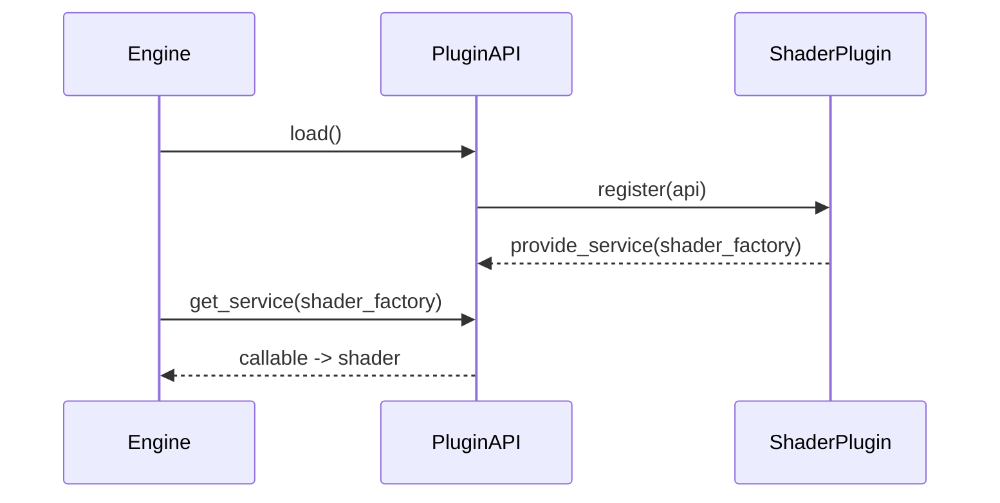

# SAGE Engine — Multilanguage & Craft Plugins

## Overview
Clean core. Everything via plugins. Now with scripting bridges: **Python, Lua, C#, C++**.

```mermaid
flowchart LR
  Core[Core Engine\nWindow + Loop + Loader] --> API[Plugin API]
  API --> Plugins
  subgraph Plugins
    P1[SAGE 2D]
    P2[Shader Subplugins]
    P3[Image Loaders]
    P4[Input Providers]
    P5[Game Scripts (Lua/Py/C#/C++)]
  end
```

## Script Bridges
- **Python**: import module, optional `init(api)` then call functions.
- **Lua** (via `lupa`): run `file.lua`, call global functions.
- **C#** (pythonnet): `clr.AddReference("YourAssembly")` then call static methods.
- **C++** (pybind11/C-extension): import compiled module and call exported functions.

## Plugin JSON (extended)
```json
{
  "id": "vendor.plugin.id",
  "name": "Nice Name",
  "version": "1.0.0",
  "category": "shader|image|input|script|renderer|camera|world|...",
  "languages": ["python","lua","csharp","cpp","glsl"],
  "entry": "plugin.py",
  "requires": ["numpy","Pillow"]
}
```

## Craft Plugins
Use `tools/plugin_crafter.py`:
```bash
python tools/plugin_crafter.py shader --out plugins/myshader --id my.shader --name "My Shader"
python tools/plugin_crafter.py image  --out plugins/imgloader
python tools/plugin_crafter.py input  --out plugins/kbinput
```

## Best Practices
- Keep each concern in its own plugin (shader/image/input).
- Prefer service factories over globals.
- Expose engine API minimally.
- Write tests per plugin.

