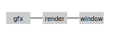

# SAGE Engine Architecture

This document describes the high level architecture for SAGE Engine based on the SAGE Feather specification.

## Modules

- **core** – entry point and dependency registry. Provides `core_boot`, `core_tick`, `core_reset` and `core_shutdown`.
- **time** – time management. Tracks delta time and frame counters.
- **timers** – simple timer manager without allocations in the update loop.
- **events** – event dispatcher with ring buffer.
- **dag** – defines execution phases with dependencies and optional parallelism.
- **scene** – scene graph storing objects as IDs with roles.
- **roles** – role schemas such as sprite or camera. Schemas are organised into
  *categories* grouping related fields.
- **tasks** – lightweight task scheduler for background logic.
- **resource** – asynchronous resource loading helpers.
- **render** – prepare/sort/flush rendering pipeline.
- **window** – platform window management.
- **settings** – engine configuration including thread limits.

Modules expose their public API via ``core.expose()`` and access others using ``core.get()`` or event subscriptions. Direct imports between modules are discouraged to keep coupling low.

Roles define permitted fields and behavior for objects while the `world` module manages scenes and layers. All interactions with objects happen through `world.scene` using `SceneEdit` so that roles remain isolated.

The engine executes in well defined phases ordered as a DAG. Each module registers its callbacks for update or draw phases.

```
boot -> update -> draw -> flush
```

### Boot sequence

1. `core_core_boot` читает `engine.sagecfg` и импортирует перечисленные модули.
2. Каждый модуль реализует функцию `boot(config)` и регистрирует свои фазы.
3. После инициализации можно запускать цикл `core_tick`.

Custom phases can be added using the `dag` module which resolves dependencies to ensure deterministic execution.

All modifications to scene objects happen via a `SceneEdit` transaction that is applied atomically between frames.

The design tries to minimize allocations during the update/draw loop and favors a Struct-of-Arrays layout for cache efficiency.



### Frame cycle

During each tick the engine executes phases in order:

1. **update** – time, timers, tasks and world logic.
2. **draw** – render preparation and sorting.
3. **flush** – final rendering and profiling.

The world module commits any pending `SceneEdit` operations during update so all reads remain consistent.

## Schema Independence

All data files include a `schema_version` integer. When loading, modules call the
compatibility helpers to upgrade older schemas transparently. This approach
removes any strict engine versioning and allows the project to maintain backward
compatibility indefinitely.
