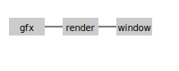

# 📘 Структура проекта SAGE Engine

Этот документ описывает все каталоги и файлы репозитория **SAGE Engine** и поясняет правила работы с архитектурой SAGE Feather. Любое изменение структуры проекта требует обновления этого файла.

## 🔹 Дерево каталогов

```text
SAGE-Engine/
├── README.md
├── test_runner.py
├── meta/
│   ├── audit_report.md
│   ├── audit_findings.md
│   ├── improvement_plan.md
│   ├── fix_roadmap.md
│   ├── benchmark.md
│   ├── test_plan.md
│   ├── issues_matrix.csv
│   └── engine.sagecfg
├── docs/
│   ├── architecture.md
│   ├── blueprint.md
│   ├── compatibility.md
│   ├── design_rules.md
│   ├── dev_guidelines.md
│   ├── events.md
│   ├── flow_script.md
│   ├── getting_started.md
│   ├── intro.md
│   ├── modules/
│   │   ├── logger.md
│   │   ├── render.md
│   │   └── window.md
│   ├── modules.md
│   ├── plugin.md
│   ├── profiler.md
│   ├── renderstream.md
│   ├── roles.md
│   ├── scene.md
│   ├── structure.md
│   ├── stable_api.md
│   ├── style_guide.md
│   ├── timers.md
│   ├── todo.md
│   └── diagrams/
│       ├── module_dependencies.svg
│       └── phase_flow.svg
│   └── examples/
│       ├── basic_scene.md
│       └── custom_role.md
├── examples/
│   └── sage_runner/        # демонстрационный раннер без реальных ассетов
├── pyproject.toml
├── roles/
│   ├── Camera.role.json
│   ├── Player.role.json
│   └── Sprite.role.json
├── sage_engine/
│   ├── resources/
│   │   ├── fonts/
│   │   │   └── default.ttf
│   │   ├── textures/
│   │   ├── themes/
│   │   ├── shaders/
│   │   ├── effects/
│   │   └── system/
│   ├── transform/
│   │   └── __init__.py
│   ├── graphics/
│   │   ├── __init__.py
│   │   ├── camera3d.py
│   │   ├── mesh3d.py
│   │   └── math3d.py
```

Каталог `resources/fonts/` содержит встроенный шрифт `default.ttf` (Public Sans). Он применяется по умолчанию всеми подсистемами и может быть заменён. Текстуры и шейдеры размещаются соответственно в `resources/textures/` и `resources/shaders/`.

```
│   ├── __init__.py
│   ├── api.py
│   ├── audio/
│   │   └── __init__.py
│   ├── blueprint/
│   │   └── __init__.py
│   ├── compat/
│   │   └── __init__.py
│   ├── core/
│   │   ├── __init__.py
│   │   └── extensible.py
│   ├── dag/
│   │   └── __init__.py
│   ├── devtools/
│   │   ├── __init__.py
│   │   ├── cli.py
│   │   ├── config_cli.py
│   │   └── generate_roles.py
│   ├── events/
│   │   └── __init__.py
│   ├── flow/
│   │   ├── __init__.py
│   │   ├── lua/
│   │   │   └── __init__.py
│   │   └── python/
│   │       └── __init__.py
│   ├── game_state/
│   │   └── __init__.py
│   ├── logger/
│   │   ├── __init__.py
│   │   ├── core.py
│   │   ├── crash.py
│   │   ├── errors.py
│   │   ├── handlers/
│   │   │   ├── base.py
│   │   │   └── console.py
│   │   ├── hooks.py
│   │   └── levels.py
│   ├── plugins/
│   │   └── __init__.py
│   ├── profiling/
│   │   └── __init__.py
│   ├── render/
│   │   ├── __init__.py
│   │   ├── api.py
│   │   └── backends/
│   │       ├── __init__.py
│   │       ├── software.py
│   │       └── vulkan.py
│   ├── gfx/
│   │   ├── __init__.py
│   │   ├── runtime.py
│   │   └── backends/
│   │       ├── __init__.py
│   │       └── software.py
│   ├── cursor/
│   │   ├── __init__.py
│   │   ├── core.py
│   │   ├── style.py
│   │   └── runtime.py
│   ├── input/
│   │   ├── __init__.py
│   │   ├── core.py
│   │   ├── map.py
│   │   ├── devices.py
│   │   ├── state.py
│   │   └── impl/
│   │       ├── win32.py
│   │       ├── x11.py
│   │       └── cocoa.py
│   ├── sprite/
│   │   ├── __init__.py
│   │   ├── draw.py
│   │   ├── sprite.py
│   │   ├── atlas.py
│   │   └── cache.py
│   ├── texture/
│   │   └── __init__.py
│   ├── animation/
│   │   ├── __init__.py
│   │   ├── runtime.py
│   │   ├── player.py
│   │   ├── sageanim.py
│   │   └── types.py
│   ├── runtime/
│   │   ├── __init__.py
│   │   └── fsync.py
│   ├── graphic/
│   │   ├── __init__.py
│   │   ├── color.py
│   │   ├── fx.py
│   │   ├── scene.py
│   │   ├── state.py
│   │   ├── api.py
│   │   ├── backend.py
│   │   ├── layout.py
│   │   ├── style.py
│   │   └── compat.py
│   ├── effects/
│   │   ├── __init__.py
│   │   ├── api.py
│   │   ├── compat.py
│   │   └── builtin/
│   ├── resource/
│   │   ├── __init__.py
│   │   ├── loader.py
│   │   ├── cache.py
│   │   ├── packer.py
│   │   └── manager.py
│   ├── format/
│   │   ├── __init__.py
│   │   ├── sageimg.py
│   │   ├── sagesfx.py
│   │   ├── sagebp.py
│   │   ├── sageflow.py
│   │   └── sagepack.py
│   ├── roles/
│   │   ├── __init__.py
│   │   ├── camera_schema.py
│   │   ├── interfaces.py
│   │   └── sprite_schema.py
│   ├── objects/
│   │   ├── __init__.py
│   │   ├── builder.py
│   │   ├── runtime.py
│   │   ├── groups.py
│   │   ├── store.py
│   │   └── roles/
│   ├── scheduler/
│   │   ├── __init__.py
│   │   ├── time.py
│   │   └── timers.py
│   ├── shaders/
│   │   └── __init__.py
│   ├── tasks/
│   │   └── __init__.py
│   ├── window/
│   │   ├── __init__.py
│   │   └── impl/
│   │       ├── cocoa.py
│   │       ├── win32.py
│   │       └── x11.py
│   ├── world/
│   │   ├── __init__.py
│   │   └── view.py
│   ├── raycast/
│   │   ├── __init__.py
│   │   ├── core.py
│   │   ├── shape.py
│   │   ├── query.py
│   │   ├── filters.py
│   │   └── results.py
│   └── settings.py
├── sage_engine/
│   └── testing/
│       ├── __init__.py
│       ├── assert_.py
│       ├── flowtest.py
│       ├── performance.py
│       ├── runner.py
│       ├── visual.py
│       ├── fixtures/
│       │   └── __init__.py
│       └── reports/
│           └── __init__.py
├── tests/
│   ├── conftest.py
│   ├── test_audio.py
│   ├── test_blueprint.py
│   ├── test_cli.py
│   ├── test_compat.py
│   ├── test_core.py
│   ├── test_crash.py
│   ├── test_dag.py
│   ├── test_events.py
│   ├── test_flow_run.py
│   ├── test_game_state.py
│   ├── test_logger.py
│   ├── test_plugins.py
│   ├── test_render.py
│   ├── test_resource.py
│   ├── test_roles_json.py
│   ├── test_scene.py
│   ├── test_tasks.py
│   ├── test_time.py
│   ├── test_timers.py
│   ├── test_visual.py
│   ├── test_window.py
│   └── test_world_load.py
```

## 🔹 Архитектурные правила

- Все модули изолированы и подключаются через `core.register(phase, callback)`.
- Цикл движка состоит из фаз `boot → update → draw → flush → shutdown`.
- Любые изменения объектов возможны только через `SceneEdit`. Прямое изменение полей запрещено.
- Модуль `world` отвечает только за загрузку и переключение сцен и слоёв.
- Модуль `objects` управляет созданием и удалением сущностей независимо от сцены.
- Модуль `roles` описывает схемы поведения и валидирует данные объектов.
  Все поля, которые передаются в `objects.spawn()`, должны быть объявлены
  в соответствующем `.role.json`, иначе создание объекта приведёт к ошибке
  типа.
- События создаются и обрабатываются модулем `events` через `emit` и `on`.
- Например, размер окна передаётся через событие `window_resized`, на которое
  подписан модуль `gfx`, что позволяет ему пересоздавать буфер без прямого
  импорта `window`.
- Модули публикуют своё API через ``core.expose()`` и получают доступ к другим
  через ``core.get()``. Это исключает жёсткие зависимости и упрощает замену
  подсистем.
- Компонентная модель не используется: все данные привязаны к ролям и
  проверяются при загрузке.
- Логирование выполняется через `logger`, уровни задаются переменной `SAGE_LOGLEVEL`.
- Форматы данных сохраняют обратную совместимость через миграции без явных номеров.

## 🔹 Масштабирование проекта

- Новые роли описываются JSON файлами в каталоге `roles/` и подключаются генератором `devtools/generate_roles.py`.
- Подплатформенные реализации (Win32, X11, Cocoa) размещаются в `window/impl/`.
- Платформенные модули ввода находятся в `input/impl/` и выбираются автоматически по `sys.platform`.
- Дополнительные рендер-бэкенды добавляются в `render/backends/`. По умолчанию  имеется `software.py`. Выбор осуществляется ключом `render_backend` в `engine.sagecfg` или переменной окружения `SAGE_RENDER_BACKEND`.
- При добавлении модуля его следует задокументировать в `engine.sagecfg` и написать тесты в `tests/`.

## 🔹 Правила логирования и тестирования

- Все публичные функции сопровождаются докстрингами.
- При изменениях необходимо дополнять тесты и запускать `pytest -q`.
- Логи пишутся в консоль через `logger.handlers.console` и могут сохраняться в файлы.

## 🔹 Рекомендации новичкам

1. Ознакомьтесь с `getting_started.md` и примерами в `examples/`.
2. Изучите структуры ролей в каталоге `roles/` и попробуйте создать свою.
3. Для поиска ошибок запускайте тесты и используйте профайлер из модуля `profiling`.

## 🔹 Обязанности по поддержке

Если при изменении проекта добавляются или переименовываются каталоги, модули или фазы, этот документ **обязательно** должен быть обновлён в том же pull request. Без актуальной документации изменение не принимается.

Диаграмма рендер-пайплайна: 
## 📌 Политика версии

SAGE Engine не использует номера версий ни в каких данных. Все изменения
обрабатываются автоматически при загрузке через модуль `compat`, обеспечивая
вечную совместимость. Миграции описываются набором правил в ``compat.MIGRATIONS``
и выполняются на лету. Пример пользовательской миграции:

```python
from sage_engine import compat

compat.MIGRATIONS["config"] = [
    compat.migrate_field("oldKey", "newKey"),
    compat.remove_field("deprecated"),
    compat.set_default("fullscreen", False),
]
```
